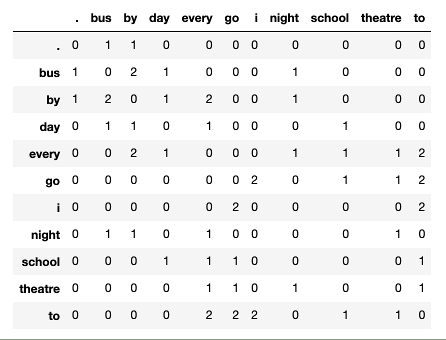
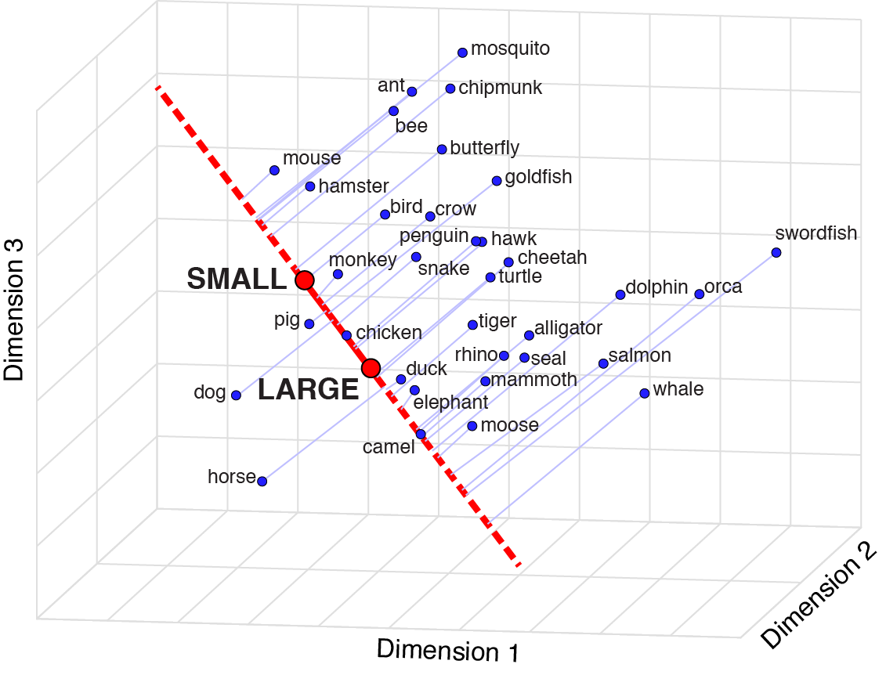

[toc]


[中文文档](chinese_readme.md)

[中文博客](https://hidadeng.github.io/blog/)

**cntext** is a text analysis package that provides traditional text analysis methods, such as word count, readability, document similarity, sentiment analysis, etc. It has built-in multiple Chinese and English sentiment dictionaries. Supporting word embedding models training and usage, cntext provides semantic distance and semantic projection now.

- [github repo](https://github.com/hidadeng/cntext) ``https://github.com/hidadeng/cntext``

- [pypi link](https://pypi.org/project/cntext/)  ``https://pypi.org/project/cntext/``

  


Functional modules include

- [x] **stats.py**  basic text information
  
  - [x] word count
  - [x] readability
  - [x] built-in dictionary 
  - [x] sentiment analysis
  
- [x] **dictionary.py** build and extend dictionary(vocabulary)
  
  - [x] throught Sopmi(mutual information) algorithm
  - [x] expand dictionary throught Word2Vec algorithm
  - [x] Glove Glove embeddings model
  
- [x] **similarity.py**   document similarity
  
  - [x] cosine algorithm
  - [x] jaccard algorithm
  - [x] edit distance algorithm
  
- [x] **mind.py**  digest cognitive(attitude、bias etc.) information

  - [x] tm.semantic_distance
  - [x] tm.semantic_projection

   


<br>

## Installation

```
pip install cntext
```


<br>

## QuickStart 

```python
import cntext as ct

help(ct)
```

Run

```
Help on package cntext:

NAME
    cntext

PACKAGE CONTENTS
    bias
    dictionary
    similarity
    stats
```


<br>


## 1. Basic

Currently, the built-in functions of stats.py are:

- **readability()**  the readability of text, support Chinese and English
- **term_freq()**  word count 
- **dict_pkl_list()**  get the list of built-in dictionaries (pkl format) in cntext
- **load_pkl_dict()**  load the pkl dictionary file
- **sentiment()** sentiment analysis
- **sentiment_by_valence()** valence sentiment analysis


```python
import cntext as ct

text = 'What a sunny day!'


diction = {'Pos': ['sunny', 'good'],
           'Neg': ['bad', 'terrible'],
           'Adv': ['very']}

ct.sentiment(text=text,
             diction=diction,
             lang='english')
```

Run

```
{'Pos_num': 1,
 'Neg_num': 0,
 'Adv_num': 0,
 'stopword_num': 1,
 'word_num': 5,
 'sentence_num': 1}
```

<br>


### 1.1  readability

The larger the indicator, the higher the complexity of the article and the worse the readability.

**readability(text, lang='chinese')**

- text:  text string
- lang:  "chinese" or "english"，default is "chinese"


```python
import cntext as ct

text = 'Committed to publishing quality research software with zero article processing charges or subscription fees.'

ct.readability(text=text, 
               lang='english')
```

Run

```
{'readability': 19.982}
```

<br>


### 1.2  term_freq(text, lang)

Word count statistics function, return Counter type.

```python
import cntext as ct

text = 'Committed to publishing quality research software with zero article processing charges or subscription fees.'

ct.term_freq(text=text, lang='english')
```

Run

```
Counter({'committed': 1, 
         'publishing': 1, 
         'quality': 1, 
         'research': 1, 
         'software': 1, 
         'zero': 1, 
         'article': 1, 
         'processing': 1, 
         'charges': 1, 
         'subscription': 1, 
         'fees.': 1})
```

<br>


### 1.3 dict_pkl_list  

get the list of built-in dictionaries (pkl format) in cntext

```python
import cntext as ct

ct.dict_pkl_list()
```

Run

```
['DUTIR.pkl',
 'HOWNET.pkl',
 'sentiws.pkl',
 'ChineseFinancialFormalUnformalSentiment.pkl',
 'Concreteness.pkl',
 'ANEW.pkl',
 'LSD2015.pkl',
 'NRC.pkl',
 'geninqposneg.pkl',
 'HuLiu.pkl',
 'AFINN.pkl',
 'ChineseEmoBank.pkl',
 'ADV_CONJ.pkl',
 'Loughran_McDonald_Financial_Sentiment.pkl',
 'Chinese_Loughran_McDonald_Financial_Sentiment.pkl',
 'STOPWORDS.pkl']
```

We list 12 pkl dictionary here, some of English dictionary listed below are organized from [quanteda.sentiment](https://github.com/quanteda/quanteda.sentiment)

| pkl文件                                     | 词典                                                         | 语言            | 功能                                                         |
| ------------------------------------------- | ------------------------------------------------------------ | --------------- | ------------------------------------------------------------ |
| ChineseEmoBank.pkl                                   | Chinese Sentiment Dictionary, includes 「valence」「arousal」. In cntext, we only take single word into account, ignore phrase.                                                        | Chinese         | valence, arousal|
| DUTIR.pkl                                   | DUTIR                                                        | Chinese         | Seven categories of emotions: 哀, 好, 惊, 惧, 乐, 怒, 恶     |
| HOWNET.pkl                                  | Hownet                                                       | Chinese         | Positive、Negative                                           |
| SentiWS.pkl                      | SentimentWortschatz (SentiWS)                                | German         | Positive、Negative；<br>                              |
| ChineseFinancialFormalUnformalSentiment.pkl | Chinese finance dictionary, contains formal、unformal、positive、negative | Chinese         | formal-pos、<br>formal-neg；<br>unformal-pos、<br>unformal-neg |
| ANEW.pkl                                    | Affective Norms for English Words (ANEW)                     | English         |                                                       |
| LSD2015.pkl                                 | Lexicoder Sentiment Dictionary (2015)                        | English         | Positive、Negative                                           |
| NRC.pkl                                     | NRC Word-Emotion Association Lexicon                         | English         | fine-grained sentiment words;                                |
| HuLiu.pkl                                   | Hu&Liu (2004)                                                | English         | Positive、Negative                                           |
| AFINN.pkl                                   | Affective Norms for English Words                        | English         |                       |
| ADV_CONJ.pkl                                | adverbial & conjunction                                      | Chinese         |                                                              |
| STOPWORDS.pkl                               |                                                              | English&Chinese | stopwordlist                                                 |
| Concreteness.pkl                            | Brysbaert, M., Warriner, A. B., & Kuperman, V. (2014). Concreteness ratings for 40 thousand generally known English word lemmas. Behavior Research Methods, 46, 904–911 | English         | word & concreateness score                                   |
| Chinese_Loughran_McDonald_Financial_Sentiment.pkl | 曾庆生, 周波, 张程, and 陈信元. "年报语调与内部人交易: 表里如一还是口是心非?." 管理世界 34, no. 09 (2018): 143-160. | Chinese | 正面、负面词                                                 |
| Loughran_McDonald_Financial_Sentiment.pkl         | Loughran, Tim, and Bill McDonald. "When is a liability not a liability? Textual analysis, dictionaries, and 10‐Ks." The Journal of finance 66, no. 1 (2011): 35-65. | English | Positive and Negative emotion words in the financial field。 Besides, in version of 2018, author add ``Uncertainty, Litigious, StrongModal, WeakModal, Constraining`` |


<br>

### 1.4 load_pkl_dict 

load the pkl dictionary file and return dict type data.

```python
import cntext as ct

print(ct.__version__)
# load the pkl dictionary file
print(ct.load_pkl_dict('NRC.pkl'))
```

Run

```
1.7.8

{'NRC': {'anger': ['abandoned', 'abandonment', 'abhor', 'abhorrent', ...],
         'anticipation': ['accompaniment','achievement','acquiring', ...],
         'disgust': ['abject', 'abortion', 'abundance', 'abuse', ...],
         'fear': ['anxiety', 'anxious', 'apache', 'appalling', ...],
         ......
 
 'Desc': 'NRC Word-Emotion Association Lexicon', 
 'Referer': 'Mohammad, Saif M., and Peter D. Turney. "Nrc emotion lexicon." National Research Council, Canada 2 (2013).'
         }
```

<br>


### 1.5 sentiment

**sentiment(text, diction, lang='chinese')**

Calculate the occurrences of each emotional category words in text; The complex influence of adverbs and negative words on emotion is not considered.

- **text**:  text string
- **diction**:  emotion dictionary data, support diy or built-in dicitonary
- **lang**: "chinese" or "english"，default is "chinese"


We can use built-in dicitonary in cntext, such as NRC.pkl

```python
import cntext as ct

text = 'What a happy day!'

ct.sentiment(text=text,
             diction=ct.load_pkl_dict('NRC.pkl')['NRC'],
             lang='english')
```

Run

```
{'anger_num': 0,
 'anticipation_num': 1,
 'disgust_num': 0,
 'fear_num': 0,
 'joy_num': 1,
 'negative_num': 0,
 'positive_num': 1,
 'sadness_num': 0,
 'surprise_num': 0,
 'trust_num': 1,
 'stopword_num': 1,
 'word_num': 5,
 'sentence_num': 1}
```

We can also use DIY dicitonary, just like

```python
import cntext as ct

text = 'What a happy day!'

diction = {'Pos': ['happy', 'good'],
           'Neg': ['bad', 'terrible'],
           'Adv': ['very']}

ct.sentiment(text=text,
             diction=diction,
             lang='english')
```

Run

```
{'Pos_num': 1,
 'Neg_num': 0,
 'Adv_num': 0,
 'stopword_num': 1,
 'word_num': 5,
 'sentence_num': 1}
```

<br>


## 1.6 sentiment_by_valence()

**sentiment_by_valence(text, diction, lang='english')**

Calculate the occurrences of each sentiment category words in text;  The complex influence of intensity adverbs and negative words on emotion is not considered.

- text:  text sring
- diction:  sentiment dictionary with valence.；
- lang: "chinese" or "english"; default language="english"


Here we want to study the concreteness of text.  The **concreteness.pkl** that comes from Brysbaert2014. 

>Brysbaert, M., Warriner, A. B., & Kuperman, V. (2014). Concreteness ratings for 40 thousand generally known English word lemmas. Behavior Research Methods, 46, 904–911

```python
import cntext as ct

# load the concreteness.pkl dictionary file;  cntext version >=1.7.1
concreteness_df = ct.load_pkl_dict('concreteness.pkl')['concreteness']
concreteness_df.head()
```

Run

|| word | valence |
| ---: | :-------------- | ----------: |
|  0 | roadsweeper   |      4.85 |
|  1 | traindriver   |      4.54 |
|  2 | tush          |      4.45 |
|  3 | hairdress     |      3.93 |
|  4 | pharmaceutics |      3.77 |

<br>

```python
reply = "I'll go look for that"

score=ct.sentiment_by_valence(text=reply, 
                              diction=concreteness_df, 
                              lang='english')
score
```

Run

```
1.85
```


<br>

```python
employee_replys = ["I'll go look for that",
                   "I'll go search for that",
                   "I'll go search for that top",
                   "I'll go search for that t-shirt",
                   "I'll go look for that t-shirt in grey",
                   "I'll go search for that t-shirt in grey"]

for idx, reply in enumerate(employee_replys):
    score=ct.sentiment_by_valence(text=reply, 
                                  diction=concreteness_df, 
                                  lang='english')
    
    template = "Concreteness Score: {score:.2f} | Example-{idx}: {exmaple}"
    print(template.format(score=score, 
                          idx=idx, 
                          exmaple=reply))
    
ct.sentiment_by_valence(text=text, diction=concreteness_df, lang='english')
```

Run

```
Concreteness Score: 1.55 | Example-0: I'll go look for that
Concreteness Score: 1.55 | Example-1: I'll go search for that
Concreteness Score: 1.89 | Example-2: I'll go search for that top
Concreteness Score: 2.04 | Example-3: I'll go search for that t-shirt
Concreteness Score: 2.37 | Example-4: I'll go look for that t-shirt in grey
Concreteness Score: 2.37 | Example-5: I'll go search for that t-shirt in grey
```


<br><br>


## 2. dictionary

This module is used to build or expand the vocabulary (dictionary), including

- **SoPmi** Co-occurrence algorithm to extend vocabulary (dictionary), Only support chinese
- **W2VModels** using word2vec to extend vocabulary (dictionary), support english & chinese 

### 2.1 SoPmi 

```python
import cntext as ct
import os

sopmier = ct.SoPmi(cwd=os.getcwd(),
                   #raw corpus data，txt file.only support chinese data now.
                   input_txt_file='data/sopmi_corpus.txt', 
                   #muanually selected seed words
                   seedword_txt_file='data/sopmi_seed_words.txt', #人工标注的初始种子词
                   )   

sopmier.sopmi()
```

Run

```
Step 1/4:...Preprocess   Corpus ...
Step 2/4:...Collect co-occurrency information ...
Step 3/4:...Calculate   mutual information ...
Step 4/4:...Save    candidate words ...
Finish! used 44.49 s
```


<br>

### 2.2 W2VModels 

**In particular, note that the code needs to set the lang parameter**

```python
import cntext as ct
import os

#init W2VModels, corpus data w2v_corpus.txt
model = ct.W2VModels(cwd=os.getcwd(), lang='english')  
model.train(input_txt_file='data/w2v_corpus.txt')


#According to the seed word, filter out the top 100 words that are most similar to each category words
model.find(seedword_txt_file='data/w2v_seeds/integrity.txt', 
           topn=100)
model.find(seedword_txt_file='data/w2v_seeds/innovation.txt', 
           topn=100)
model.find(seedword_txt_file='data/w2v_seeds/quality.txt', 
           topn=100)
model.find(seedword_txt_file='data/w2v_seeds/respect.txt', 
           topn=100)
model.find(seedword_txt_file='data/w2v_seeds/teamwork.txt', 
           topn=100)
```

Run

```
Step 1/4:...Preprocess   corpus ...
Step 2/4:...Train  word2vec model
            used   174 s
Step 3/4:...Prepare similar candidates for each seed word in the word2vec model...
Step 4/4 Finish! Used 187 s
Step 3/4:...Prepare similar candidates for each seed word in the word2vec model...
Step 4/4 Finish! Used 187 s
Step 3/4:...Prepare similar candidates for each seed word in the word2vec model...
Step 4/4 Finish! Used 187 s
Step 3/4:...Prepare similar candidates for each seed word in the word2vec model...
Step 4/4 Finish! Used 187 s
Step 3/4:...Prepare similar candidates for each seed word in the word2vec model...
Step 4/4 Finish! Used 187 s

```

<br>

### Note

When runing out the W2VModels, there will appear a file called **w2v.model**  in the directory of **output/w2v_candi_words**.Note this w2v file can be used later.

```python
from gensim.models import KeyedVectors

w2v_model = KeyedVectors.load("the path of w2v.model")
#to extract vector for word
#w2v_model.get_vector(word)
#if you need more information about the usage of w2_model, please use help function
#help(w2_model)
```

For example, we load the ``output/w2v_candi_words/w2v.model`` 

```python
from gensim.models import KeyedVectors

w2v_model = KeyedVectors.load('output/w2v_candi_words/w2v.model')
# find the most similar word in w2v.model
w2v_model.most_similar('innovation')
```

Run

```
[('technology', 0.689210832118988),
 ('infrastructure', 0.669672966003418),
 ('resources', 0.6695448160171509),
 ('talent', 0.6627111434936523),
 ('execution', 0.6549549102783203),
 ('marketing', 0.6533523797988892),
 ('merchandising', 0.6504817008972168),
 ('diversification', 0.6479553580284119),
 ('expertise', 0.6446896195411682),
 ('digital', 0.6326863765716553)]
```

<br>

```python
#to extract vector for "innovation"
w2v_model.get_vector('innovation')
```

Run

```
array([-0.45616838, -0.7799563 ,  0.56367606, -0.8570078 ,  0.600359  ,
       -0.6588043 ,  0.31116748, -0.11956959, -0.47599426,  0.21840936,
       -0.02268819,  0.1832016 ,  0.24452794,  0.01084935, -1.4213187 ,
        0.22840202,  0.46387577,  1.198386  , -0.621511  , -0.51598716,
        0.13352732,  0.04140598, -0.23470387,  0.6402956 ,  0.20394802,
        0.10799981,  0.24908689, -1.0117126 , -2.3168423 , -0.0402851 ,
        1.6886286 ,  0.5357047 ,  0.22932841, -0.6094084 ,  0.4515793 ,
       -0.5900931 ,  1.8684244 , -0.21056202,  0.29313338, -0.221067  ,
       -0.9535679 ,  0.07325   , -0.15823542,  1.1477109 ,  0.6716076 ,
       -1.0096023 ,  0.10605699,  1.4148282 ,  0.24576302,  0.5740349 ,
        0.19984631,  0.53964925,  0.41962907,  0.41497853, -1.0322098 ,
        0.01090925,  0.54345983,  0.806317  ,  0.31737605, -0.7965337 ,
        0.9282971 , -0.8775608 , -0.26852605, -0.06743863,  0.42815775,
       -0.11774074, -0.17956367,  0.88813037, -0.46279573, -1.0841943 ,
       -0.06798118,  0.4493006 ,  0.71962464, -0.02876493,  1.0282255 ,
       -1.1993176 , -0.38734904, -0.15875885, -0.81085825, -0.07678922,
       -0.16753489,  0.14065655, -1.8609751 ,  0.03587054,  1.2792674 ,
        1.2732009 , -0.74120265, -0.98000383,  0.4521185 , -0.26387128,
        0.37045383,  0.3680011 ,  0.7197629 , -0.3570571 ,  0.8016917 ,
        0.39243212, -0.5027844 , -1.2106236 ,  0.6412354 , -0.878307  ],
      dtype=float32)
```

<br><br>


### 2.3 co_occurrence_matrix

generate word co-occurrence matrix

```python
import cntext as ct

documents = ["I go to school every day by bus .",
         "i go to theatre every night by bus"]

ct.co_occurrence_matrix(documents, 
                        window_size=2, 
                        lang='english')
```




<br><br>


### 2.4  Glove

Build the Glove model for english corpus data. corpus file path is ``data/brown_corpus.txt``

```python
import cntext as ct
import os

model = ct.Glove(cwd=os.getcwd(), lang='english')
model.create_vocab(file='data/brown_corpus.txt', min_count=5)
model.cooccurrence_matrix()
model.train_embeddings(vector_size=50, max_iter=25)
model.save()
```

Run

```
Step 1/4: ...Create vocabulary for Glove.
Step 2/4: ...Create cooccurrence matrix.
Step 3/4: ...Train glove embeddings. 
             Note, this part takes a long time to run
Step 3/4: ... Finish! Use 175.98 s
```

The generate生成的词嵌入模型文件位于output/Glove内

<br><br>


## 3. similarity

Four text similarity functions

- **cosine_sim(text1, text2)**
- **jaccard_sim(text1, text2)**   
- **minedit_sim(text1, text2)**  
- **simple_sim(text1, text2)** 

Algorithm implementation reference from ``Cohen, Lauren, Christopher Malloy, and Quoc Nguyen. Lazy prices. No. w25084. National Bureau of Economic Research, 2018.``


<br>

```python
import cntext as ct 


text1 = 'Programming is fun!'
text2 = 'Programming is interesting!'

print(ct.cosine_sim(text1, text2))
print(ct.jaccard_sim(text1, text2))
print(ct.minedit_sim(text1, text2))
print(ct.simple_sim(text1, text2))
```

Run

```
0.67
0.50
1.00
0.90
```

<br><br>

## 4. Text2Mind

Word embeddings contain human cognitive information. 

- **tm.sematic_distance(words, c_words1, c_words2)**  
- **tm.sematic_projection(words, c_words1, c_words2)**  


### 4.1 tm.sematic_distance(words, c_words1, c_words2) 

Calculate the two semantic distance， and return the difference between the two.

- **words**   concept words, words = ['program', 'software', 'computer']
- **c_words1**  concept words1,  c_words1 = ["man", "he", "him"]
- **c_words2**  concept words2, c_words2 = ["woman", "she", "her"]


For example, 

```
male_concept = ['male', 'man', 'he', 'him']

female_concept = ['female', 'woman', 'she', 'her']

software_engineer_concept  = ['engineer',  'programming',  'software']

d1 = distance(male_concept,  software_engineer_concept)

d2 = distance(female_concept,  software_engineer_concept)
```

If d1-d2<0，it means in semantic space,  between man and woman, software_engineer_concept is more closer to male_concept。

In other words, there is a stereotype (bias) of women for software engineers in this corpus.

[download glove_w2v.6B.100d.txt from google Driver](https://drive.google.com/file/d/1tuQB9PDx42z67ScEQrg650aDTYPz-elJ/view?usp=sharing) 


```python
import cntext as ct

#Note: this is a word2vec format model
tm = ct.Text2Mind(w2v_model_path='glove_w2v.6B.100d.txt')

engineer = ['program', 'software', 'computer']
mans =  ["man", "he", "him"]
womans = ["woman", "she", "her"]


tm.sematic_distance(words=animals, 
                    c_words1=mans, 
                    c_words2=womans)
```

Run

```
-0.38
```

-0.38 means in semantic space, engineer is closer to man, other than woman.

<br>

### 4.2 tm.sematic_projection(words, c_words1, c_words2) 

To explain the semantic projection of the word vector model, I use the picture from a Nature paper in 2022[@Grand2022SemanticPR]. Regarding the names of animals, human cognition information about animal size is hidden in the corpus text. By projecting the meaning of **LARGE WORDS** and **SMALL WORDS** with the vectors of different **animals**, the projection of the animal on the **size vector**(just like the red line in the bellow picture) is obtained, so the size of the animal can be compared by calculation.

Calculate the projected length of each word vector in the concept vector.Note that the calculation result reflects the direction of concept.**Greater than 0 means semantically closer to c_words2**.


> Grand, G., Blank, I.A., Pereira, F. and Fedorenko, E., 2022. Semantic projection recovers rich human knowledge of multiple object features from word embeddings. _Nature Human Behaviour_, pp.1-13.




For example, in the corpus,  perhaps show that our human beings have different size memory(perception) about animals.

```python
animals = ['mouse', 'cat', 'horse',  'pig', 'whale']
small_words = ["small", "little", "tiny"]
large_words = ["large", "big", "huge"]

tm.sematic_projection(words=animals, 
                      c_words1=small_words, 
                      c_words2=large_words)
```

Run

```
[('mouse', -1.68),
 ('cat', -0.92),
 ('pig', -0.46),
 ('whale', -0.24),
 ('horse', 0.4)]
```

Regarding the perception of size, humans have implied in the text that mice are smaller and horses are larger.

<br><br>


## Citation
If you use **cntext** in your research or in your project, please cite:


```
@misc{dengcntext,
  title={cntext},
  author={Xudong Deng and Nan Peng},
  howpublished={\url{https://github.com/hidadeng/cntext}},
  year={2022}
}
```

